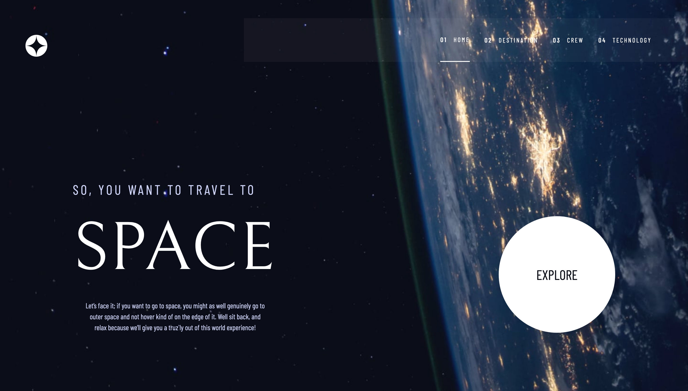

# Frontend Mentor - Space tourism website solution

This is a solution to the [Space tourism website challenge on Frontend Mentor](https://www.frontendmentor.io/challenges/space-tourism-multipage-website-gRWj1URZ3). Frontend Mentor challenges help you improve your coding skills by building realistic projects. 

## Table of contents

- [Frontend Mentor - Space tourism website solution](#frontend-mentor---space-tourism-website-solution)
  - [Table of contents](#table-of-contents)
  - [Overview](#overview)
    - [The challenge](#the-challenge)
    - [Screenshot](#screenshot)
    - [Links](#links)
  - [My process](#my-process)
    - [Built with](#built-with)
    - [What I learned](#what-i-learned)
  - [Author](#author)

**Note: Delete this note and update the table of contents based on what sections you keep.**

## Overview

### The challenge

Users should be able to:

- View the optimal layout for each of the website's pages depending on their device's screen size
- See hover states for all interactive elements on the page
- View each page and be able to toggle between the tabs to see new information

### Screenshot

### Links

- Solution URL: [https://www.frontendmentor.io/solutions/space-tourism-multipage-website-Hw_Cm5mtAZ](https://www.frontendmentor.io/solutions/space-tourism-multipage-website-Hw_Cm5mtAZ)
- Live Site URL: [https://space-tourism-h15m.onrender.com](https://space-tourism-h15m.onrender.com)

## My process

### Built with

- Semantic HTML5 markup
- Mobile-first workflow
- [React](https://reactjs.org/) - JS library
- [Typescript](https://www.typescriptlang.org/) - As the language
- [vite](https://vitejs.dev/) - As the bundler
- [tailwindcss](https://tailwindcss.com/) - For styles
- [@tanstack/react-query](https://tanstack.com/query/v4/docs/react/overview) - For data fetching

### What I learned

I used this project to strengthen my knowledge and experience using React with Typescript and tailwindcss as my go to styling option.

## Author

- Linkedin - [Hannanel Gershinsky]("https://www.linkedin.com/in/hannanel-gershinsky/")
- Frontend Mentor - [@hannanel100](https://www.frontendmentor.io/profile/hannanel100)
